# PatchPilot

[](https://github.com/Caleb-Todd-commits/PatchPilot/actions/workflows/demo.yml)

An AI verified-fix agent that turns bug reports into failing regression tests, patches code, reruns tests, and writes PR-ready repair reports.

Demo GIF goes here.

## Judges: Start Here

Fastest reproducible demo, no API key required:

```bash
npm install
npm run demo:offline
```

Live OpenAI demo:

```bash
cp .env.example .env
# add OPENAI_API_KEY to .env
npm run demo
```

Inspect the proof artifacts:

```text
.tmp/demo-workspace/.patchpilot/runs/latest/report.md
.tmp/demo-workspace/.patchpilot/runs/latest/trace.json
.tmp/demo-workspace/.patchpilot/runs/latest/generated-test.diff
.tmp/demo-workspace/.patchpilot/runs/latest/implementation.diff
```

For a text version of the demo, see [docs/demo-transcript.md](docs/demo-transcript.md).

## What It Does

PatchPilot reads a natural-language bug report, inspects a local JavaScript or TypeScript repo, selects likely source and test files, writes a regression test, confirms the test fails, patches the implementation, reruns tests, and saves a repair report with trace artifacts.

The included demo repo has a cart total bug: `calculateTotal([])` crashes because the cart total logic assumes at least one item.

## Why This Is A System, Not A Prompt

PatchPilot is a small verified-fix pipeline:

- baseline test execution before any file changes
- repo inspection before generation
- structured AI decisions validated with Zod
- deterministic file writes with backups
- generated regression test execution
- baseline -> red -> green verification
- trace artifacts for every run
- a learned regression artifact for future review

## Trace Excerpt

The trace makes the system loop explicit:

```json
{
  "steps": [
    { "name": "read_bug_report", "status": "passed" },
    { "name": "run_baseline_tests", "status": "passed" },
    { "name": "select_files", "status": "passed" },
    { "name": "generate_regression_test", "status": "passed" },
    { "name": "run_tests_before_fix", "status": "failed" },
    { "name": "generate_patch", "status": "passed" },
    { "name": "run_tests_after_fix", "status": "passed" }
  ],
  "finalStatus": "passed"
}
```

## Offline Demo

`npm run demo:offline` is the reproducibility demo. It uses canned structured outputs for the included demo, but it still executes the real tool loop: file writes, baseline tests, failing generated regression test, implementation patch, final tests, trace, report, and diffs.

## Live OpenAI Run

`npm run demo` is the live OpenAI demo. Live mode uses OpenAI to:

- select relevant files
- generate a regression test
- generate an implementation patch
- verify the fix through the same baseline -> red -> green loop

Live mode uses the OpenAI Responses API with `OPENAI_MODEL=gpt-4.1-mini` by default. Model outputs are requested as strict JSON and validated with Zod before PatchPilot touches the repo. Live mode was smoke-tested against the included demo repo; see [docs/live-smoke.md](docs/live-smoke.md).

## Quickstart

```bash
npm install
npm run demo:offline
```

Quality checks:

```bash
npm run build
npm test
```

You can also run PatchPilot directly:

```bash
npm run build
node dist/cli.js run --repo ./demo-repo --issue ./demo-repo/issues/empty-cart.md --test "npm test"
```

## Architecture

```mermaid
flowchart LR
  BugReport[Bug Report] --> RepoInspector[Repo Inspector]
  RepoInspector --> BaselineRunner[Baseline Test Runner]
  BaselineRunner --> FileSelector[File Selector]
  FileSelector --> RegressionTestWriter[Regression Test Writer]
  RegressionTestWriter --> TestRunner1[Test Runner]
  TestRunner1 --> PatchWriter[Patch Writer]
  PatchWriter --> TestRunner2[Test Runner]
  TestRunner2 --> TraceReport[Trace + Report]
```



## Artifacts

Demo runs copy `demo-repo` into `.tmp/demo-workspace` and write artifacts to:

```text
.tmp/demo-workspace/.patchpilot/runs/latest/
```

The latest run includes:

- `trace.json`
- `report.md`
- `test-baseline.txt`
- `test-before.txt`
- `test-after.txt`
- `generated-test.diff`
- `implementation.diff`
- `learned-regression.json`

The terminal also prints a compact verdict block with mode, changed files, and the artifact directory.

## Limitations

- MVP focused on small JS/TS repos
- full-file rewrite for demo reliability
- patches should be reviewed
- no auto-commit or PR creation
