# PatchPilot

[](https://github.com/Caleb-Todd-commits/PatchPilot/actions/workflows/demo.yml)

PatchPilot is an AI verified-fix agent that turns natural-language bug reports into failing regression tests, patches the code, reruns the test suite, and writes a PR-ready repair report.

**Input:** a bug report  
**Output:** a verified code fix with red-green test proof, trace artifacts, and a review-ready report.

## 90-second demo

Demo GIF/video goes here.

## Judges: Start Here

Fast deterministic demo:

```bash
npm install
npm run demo:offline
```

Live OpenAI demo:

```bash
cp .env.example .env
# Add OPENAI_API_KEY=your_key_here
npm run demo
```

Inspect the proof artifacts:

```text
.tmp/demo-workspace/.patchpilot/runs/latest/report.md
.tmp/demo-workspace/.patchpilot/runs/latest/trace.json
.tmp/demo-workspace/.patchpilot/runs/latest/generated-test.diff
.tmp/demo-workspace/.patchpilot/runs/latest/implementation.diff
```

A judge should understand the product in 10 seconds and run it in under 3 minutes.

For a text version of the demo, see [docs/demo-transcript.md](docs/demo-transcript.md).

## What It Does

PatchPilot reads a natural-language bug report, inspects a local JavaScript or TypeScript repo, selects likely source and test files, writes a regression test, confirms the test fails, patches the implementation, reruns tests, and saves a repair report with trace artifacts.

The included demo repo has a cart total bug: `calculateTotal([])` crashes because the cart total logic assumes at least one item.

## Why this is not a prompt wrapper

A prompt wrapper would ask an AI to suggest a fix.

PatchPilot runs a verified repair loop:

1. Reads a natural-language bug report.
2. Inspects the repository.
3. Uses OpenAI to select relevant files.
4. Uses OpenAI to generate a regression test.
5. Writes the regression test to disk.
6. Runs the real test suite and confirms the bug fails.
7. Uses OpenAI to generate an implementation patch.
8. Writes the patch to disk.
9. Reruns the real test suite and confirms the fix passes.
10. Saves trace artifacts, diffs, learned regression data, and a PR-ready report.

The AI makes structured engineering decisions. Deterministic tools handle file writes, test execution, validation, artifact generation, and safety checks.

## Trace Excerpt

The trace makes the system loop explicit:

```json
{
  "mode": "live",
  "model": "gpt-4.1-mini",
  "openaiCalls": [
    "file_selection",
    "regression_test_generation",
    "implementation_patch_generation"
  ],
  "steps": [
    { "name": "read_bug_report", "status": "passed" },
    { "name": "run_baseline_tests", "status": "passed" },
    { "name": "generate_regression_test", "status": "passed" },
    { "name": "run_tests_before_fix", "status": "failed" },
    { "name": "generate_patch", "status": "passed" },
    { "name": "run_tests_after_fix", "status": "passed" }
  ],
  "finalStatus": "passed"
}
```

## Quality Proof

CI does more than run a passing build. After `npm run demo:offline`, `scripts/write-ci-summary.mjs` reads the generated `trace.json`, verifies the required artifacts exist, and fails the workflow unless the proof shows baseline tests passed, the generated regression test failed, the implementation patch was applied, and final tests passed.

For a local submission check, run:

```bash
npm run quality
```

## Offline Demo

`npm run demo:offline` is the reproducibility demo. It uses canned structured outputs for the included demo, but it still executes the real tool loop: file writes, baseline tests, failing generated regression test, implementation patch, final tests, trace, report, and diffs.

## Live OpenAI Run

`npm run demo` is the live OpenAI demo. Live mode uses OpenAI to:

- select relevant files
- generate a regression test
- generate an implementation patch
- verify the fix through the same baseline -> red -> green loop

Live mode uses the OpenAI Responses API with `OPENAI_MODEL=gpt-4.1-mini` by default. Model outputs are requested as strict JSON and validated with Zod before PatchPilot touches the repo. Live mode was smoke-tested against the included demo repo; see [docs/live-smoke.md](docs/live-smoke.md).

Sanitized sample live artifacts are checked in at [docs/sample-live-run](docs/sample-live-run/):

- [trace.json](docs/sample-live-run/trace.json)
- [report.md](docs/sample-live-run/report.md)
- [generated-test.diff](docs/sample-live-run/generated-test.diff)
- [implementation.diff](docs/sample-live-run/implementation.diff)

## Quickstart

```bash
npm install
npm run demo:offline
```

Quality checks:

```bash
npm run build
npm test
```

You can also run PatchPilot directly:

```bash
npm run build
node dist/cli.js run --repo ./demo-repo --issue ./demo-repo/issues/empty-cart.md --test "npm test"
```

Add `--offline` to `run` for deterministic canned outputs without an API key.

## Architecture

```mermaid
flowchart LR
  BugReport[Bug Report] --> RepoInspector[Repo Inspector]
  RepoInspector --> BaselineRunner[Baseline Test Runner]
  BaselineRunner --> FileSelector[File Selector]
  FileSelector --> RegressionTestWriter[Regression Test Writer]
  RegressionTestWriter --> TestRunner1[Test Runner]
  TestRunner1 --> PatchWriter[Patch Writer]
  PatchWriter --> TestRunner2[Test Runner]
  TestRunner2 --> TraceReport[Trace + Report]
```



## Artifacts

Demo runs copy `demo-repo` into `.tmp/demo-workspace` and write artifacts to:

```text
.tmp/demo-workspace/.patchpilot/runs/latest/
```

The latest run includes:

- `trace.json`
- `report.md`
- `test-baseline.txt`
- `test-before.txt`
- `test-after.txt`
- `generated-test.diff`
- `implementation.diff`
- `learned-regression.json`

The terminal also prints a compact verdict block with mode, changed files, and the artifact directory.

## Limitations

- MVP focused on small JS/TS repos
- full-file rewrite for demo reliability
- patches should be reviewed
- no auto-commit or PR creation
